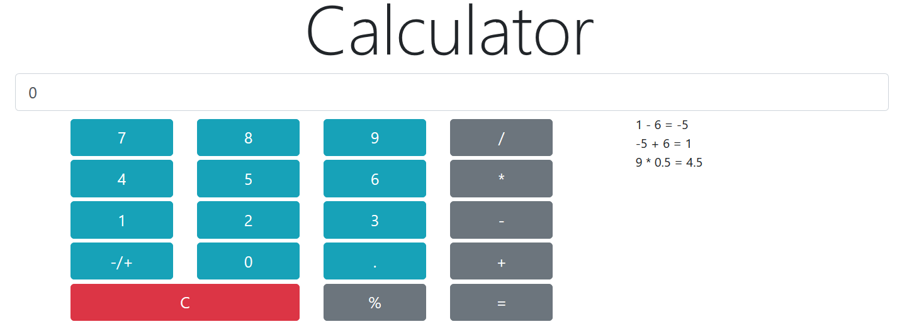

# Calculator
Calculator is a web application that performs arithmetic operations\
on integers and floating-point numbers.

# Implemented Features
* Addition
* Substraction
* Multiplication
* Division
* Percent calculation
* Number sign change
* Clear result operation
* Input from button click
* Input from keyboard
* Operation log

# Screenshots

# Built With
Vanilla JS ES2018
